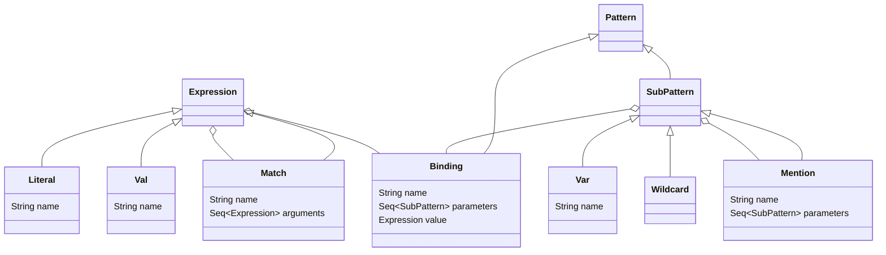

# Задача 2. Движок паттерн-матчинга "PaDDLe"

10 баллов (основная часть) + 5 баллов (5 дополнительных задач по 1 баллу каждая)

**Если что-то в описании задачи кажется неоднозначным или непонятным, не стесняйтесь задавать вопросы преподавателю**

## Основная часть (10 баллов)

В компании Classy Expression Inc. спроектировали движок сопоставления с образцом - механизма обработки структурированных данных, в соответствии с частичным или полным совпадением их требуемого и фактического устройства. Такой механизм уже знаком нам по ключевому слову [match](https://docs.scala-lang.org/tour/pattern-matching.html) и объектам-экстракторам с методом `unapply`. Движок вместе с языком предметной области, позволяющим задавать шаблоны и сопоставлять их с фактическими данными, имеет название PaDDLe - PAttern Definition & Detection LanguagE. Вам предлагается реализовать движок в виде программы на языке программирования Scala в соответствии с его описанием.

### Описание языка PaDDLe и механизма работы движка сопоставления с образцом

#### Знакомство с языком

Язык PaDDLe не имеет устойчивой грамматики, тем не менее, корректный текст на нём мог бы выглядеть следующим образом:

```
let True = true
let False = false
let Or True _ = True
let Or _ x = x

in Or True False
```

Будем говорить, что строка, начинающаяся с `let` задаёт *связку* (англ. binding) *шаблона* (англ. pattern) с некоторым
*значением* (англ. value), а строка, начинающаяся с `in` *инициирует* *сопоставление* (англ. matching) выражения (англ. expression) с некоторым шаблоном.

Например, строка `let True = true` определяет связку шаблона, доступного по имени `True` с значением `true`,
а строка `in True` инициирует сопоставление выражения `True` с ранее определенным шаблоном, в результате
которого должно получиться значение `true`.

Шаблоны могут иметь параметры, например строку `let First x y = x` можно рассматривать как связку шаблона, который определяется именем `First` и параметрами `x` и `y`, с значением, которое соответствует параметру `x`.
Так, если представленная выше связка определена, строка `in First hello world` должна инициировать сопоставление
выражения `First hello world` с шаблоном `First x y`, в результате которого фактический параметр (аргумент) выражения `hello` должен связаться с параметром шаблона `x`, и в результате должно получиться значение `hello`.

Шаблоны могут быть вложенными. Рассмотрим следующий текст:

```
let Identity x = x
let OddSecond _ (Identity x) = x

in OddSecond 42 (Identity 10)
```

В тексте определяется шаблон `Identity` с параметром `x`, который связывает `x` с некоторым значением в результате
сопоставления шаблона с конкретным выражением. Также в нём определяется шаблон `OddSecond`, который имеет два параметра -- первый неименованный, что говорит о том, что он принимает любые значения в ходе сопоставления с образцом, и не связывает конкретные значения с некоторым именем; и второй, на который накладывается ограничение, что он должен сам представлять из себя шаблон вида `Identity x`, и связывает некоторое значение с именем `x`. Таким образом, в результате сопоставления `in OddSecond 42 (Identity 10)` с шаблоном должно получиться значение 10.

#### Встроенный язык предметной области PaDDLeDSL и устройство исходного кода задания

В исходном коде задания PaDDLe реализован как встроенный язык предметной области (англ. Embedded Domain Specific Language, eDSL), конструкции которого выражаются в терминах некоторого другого языка, в нашем случае, Scala (о том, что такое eDSL, можно также прочитать на WikiWikiWeb — [link](http://wiki.c2.com/?EmbeddedDomainSpecificLanguage)).

Типы данных, которые моделируют конструкции языка, объявлены в файле `paddle.scala`, в объекте `PaDDLe`;
вспомогательные конструкции, которые упрощают объявление связок, шаблонов и выражений, и собственно,
задают eDSL, находятся в файле `sanity_check.scala`, в объекте `PaDDLeDSL`.

Рассмотрим иерархию типов `PaDDLe` (напоминание — белый треугольник на конце дуги означает наследование, белый ромбик означает агрегирование):



Шаблоны (экземпляры `Pattern`) могут быть:

* связками (`Binding`), которые соединяют шаблон с именем `name` и
  параметрами-подшаблонами `parameters` с выражением `value`;
* подшаблонами (`SubPattern`):
  - переменными (`Var`), которые связывают сопоставленную часть выражения с именем переменной `name`;
  - произвольными шаблонами — переменными без имени (`Wildcard`), с которыми можно успешно сопоставить
    любую часть выражения;
  - упоминаниями какой-либо связки (`Mention`), с которой можно сопоставить часть некоторого выражения.

Выражениями (`Expression`), которые могут быть привязаны к шаблонам связками, или могут быть с ними сопоставлены,
являются:

* литералы (`Literal`), то есть, простые выражения, характеризующиеся своим строковым представлением `name`;
* значения (`Val`), то есть, упоминание по имени `name` некоторой переменной `Var`, которая встретилась
  раньше при сопоставлении выражения;
* сопоставления (`Match`), то есть выражения, которые должны быть сопоставлены некоторому шаблону с именем
  `name`, аргументы этого выражения `arguments` для этого должны быть успешно сопоставлены параметрам
  шаблона (связки или её *упоминания*).

Теперь рассмотрим вспомогательные процедуры, которые расположены в объекте `PaDDLeDSL` файла `sanity_check.scala`
и предназначены для более простого конструирования шаблонов и выражений:

* `val __ = Wildcard` — произвольный шаблон;
* `def l` — конструктор выражений-литералов, вызов `"hello".l` породит вам литерал `"hello"`;
* `def &` — конструктор шаблонов-переменных, вызов `"x".&` породит вам шаблон, связывающий выражение с именем `x`;
* `def *` — конструктор выражений, обращающихся к некоторой переменной, доступной в ходе сопоставления с шаблоном;
  вызов `"x".*` породит вам выражение, которое попробует получить значение, соответствующее в контексте переменной с именем `x`;
* `def let`, `~=` — конструктор шаблонов-связок, вызов `let("Hello")() ~= "hello".l` породит вам шаблон-связку без параметров, который связывает шаблон с именем `Hello` с литералом `"hello"`; вызов `let("Identity")("x".&) ~= "x".*` породит вам шаблон с именем `Identity` и параметром-переменной `x`, который будет связан с выражением, которое попробует прочитать значение `x` в результате успешного соответствия шаблона;
* `def ??` — конструктор шаблонов-упоминаний, вызов `let("OddSecond")(__, ??("Identity")("x").&) ~= "x".*` породит вам связку `OddSecond _ (Identity x) = x`, где `Identity` это упоминание ранее определенной связки `Identity x = x`;
* `def !!` — конструктор выражений сопоставлений, вызов `!!("Identity")("hello".l)` породит вам инициирование сопоставления `in Identity hello`;
* `def patterns` — задаёт перечисление шаблонов-связок, которые определяются сверху-вниз, и видны выражениям, требующим сопоставление с шаблоном, в таком же порядке.

Имея перечисление заданных шаблонов и выражение, которое должно вычислиться в литерал или сопоставиться с шаблоном,
можно запустить процесс вычисления выражения с помощью движка, вызвав процедуру `PaDDLe.evaluate` (доступна в 
методе `runSanityCheck` файла `sanity_check.scala` просто как `eval`):

```scala
import PaDDLe.{evaluate as eval}
import PaDDLeDSL.*

val `identity pattern` = patterns(
  let("Identity")("x".&) ~= "x".*
)

assert(eval(`identity pattern`, !!("Identity")("hello".l)) == "hello".l)
assert(eval(`identity pattern`, !!("Identity")("42".l)) == "42".l)
```

При правильной реализации `PaDDLe.evaluate` эти выражения должны
успешно вычислиться, не приведя к падению программы на этапе
исполнения.

**Правильно реализовать `PaDDLe.evaluate`, в соответствии с механизмом
работы, описанным ниже, и требуется в рамках данной задачи.**

#### Формальный механизм работы движка сопоставления с образцом

1. Процесс сопоставления с образцом состоит в вычислении выражения `expression: Expression` в соответствии с 
   последовательностью шаблонов `patterns: Seq[Pattern]` в процедуре `PaDDLe.evaluate`.
2. Если при вызове `evaluate`, выражение `expression` оказалось литералом, нужно просто вернуть данное выражение.
3. Если выражение `expression` инициирует сопоставление с шаблоном-связкой (является `Match`), нужно попробовать
   сопоставить выражение с каждой связкой из `patterns`, начиная с первого и заканчивая последним, и в случае
   успешного сопоставления, получить значение (`value`), соответствующее текущей связке.
4. Сопоставление выражения (`Match`) со связкой (`Binding`) начинается с сравнения названий (`name`) выражения
   и связки, в случае успеха, связка считается кандидатом на успешное сопоставление с выражением. В обратном случае,
   попытка сопоставления повторяется со следующей связкой в последовательности.
5. Сопоставление выражения со связкой (кандидатом на успешное сопоставление) продолжается сравнением количества
   параметров выражения и связки, если количество параметров совпадает, связка сохраняет статус кандидата. В обратном
   случае, попытка сопоставления повторяется со следующей связкой в последовательности.
6. Каждый аргумент текущего `Match` и параметр текущей связки `Binding` сопоставляются между собой:
   * `Var` и `Wildcard` успешно сопоставляются с любым текущим подвыражением исходного `Match`;
   * `Mention` успешно сопоставляется только при условии, что текущий аргумент `Match` также является `Match`,
   имеет такое же значение поля `name`, что и `Mention`, такое же количество аргументов/параметров, что и `Mention`,
   аргументы `Match` соответствуют параметрам `Match` (которые также могут быть подшаблонами, как и аргументы `Mention`
   могут быть подвыражениями).
7. В случае успешного сопоставления всех параметров связки с аргументами `Match`, начинается процесс вычисления
   значения (`value`), соответствующего текущей связке (`Binding`):
   * переменные `Var`, объявленные в параметрах связки и его подшаблонах, связываются с частями
     сопоставляемого выражения и его подвыражений (см. тип `LocalEnvironment` в файле `paddle.scala`);
   * механизм, аналогичный процедуре `evaluate`, запускается для значения (`value`) текущей связки,
     с тем отличием, что в контексте такого вычисления доступны привязки переменных (`Var`) к частям сопоставленного
     выражения (`Expression`). Назовем такую процедуре `evaluateLocally`;
   * если выражением `evaluateLocally` является `Val`, нужно найти такую привязку `Var` к `Expression`, что
     `Var` имеет такое же имя (`name`), что и текущий `Val`, и вернуть соответствующее выражение (`Expression`).

### Минимальная проверка работоспособности программы

Запустить программу можно через скрипты, которые находятся в папке с текущим файлом (`sh run-sanity-check.sh` для `Bash`, `./run-sanity-check.bat` для `cmd.exe` и `Powershell`).

Эти скрипты только и делают, что:

```bash
# Создают директорию, в которой будут находиться скомпилированные class-файлы
> mkdir classes
# Компилируют файл с реализацией движка — paddle.scala, указав директорию в качестве места, где будут находиться class-файлы
> scalac -d classes paddle.scala
# Исполняют sanity_check.scala через команду `scala`, с добавлением полученных class-файлы в список загружаемых классов JVM с помощью ключа -classpath
> scala -classpath classes sanity_check.scala
```

## Дополнительные задачи

- Используйте при реализации механизм примесей (mixins) — **1 балл**
- Используйте при реализации механизм ограничений на класс-потомок — **1 балл**
- Реализуйте отладочную трассировку создания шаблонов и выражений с помощью механизма примесей и линеаризации иерархии наследования — **2 балла**
- Проведите рефакторинг объекта `PaDDLe` — сделайте его абстрактным классом или трейтом, объявите тип `LocalEnvironment` абстрактным элементом вашего типа, предоставьте экземпляр `PaDDLe`, в котором `LocalEnvironment` объявлен как конкретный тип — **1 балл**
